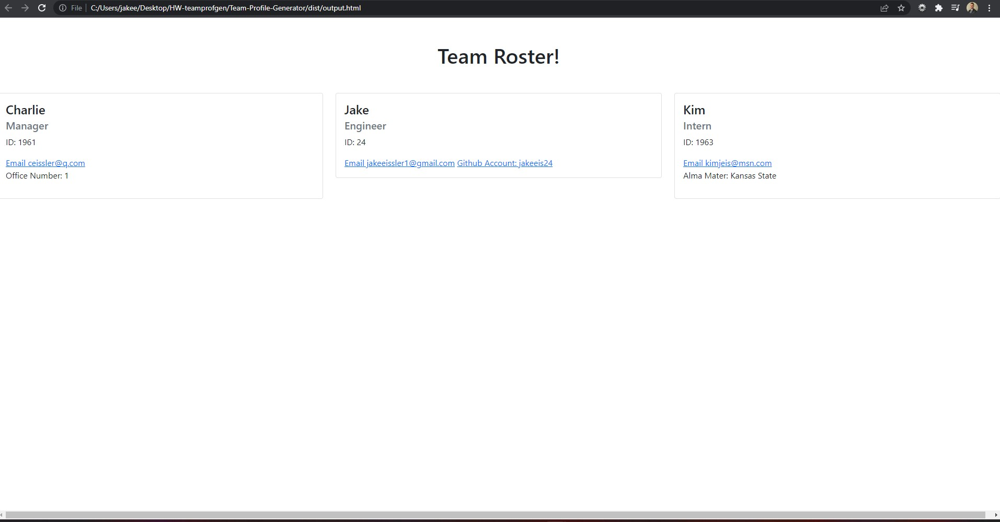

# Team Profile Generator

# Description

This command line application allows the user to generate cards for all of their employees.

[Walkthrough Video](https://drive.google.com/file/d/1Svpp3fkK_VlD41uqwmt-dl588imoapDI/view)

# Table of Contents

[Installation](#instructions)

[Usage](#usage)

[Contributing](#contributing)

[Tests](#tests)

[Questions](#questions)

[License](#license)

# Installation

Clone the repo to your local machine. Then npm init -y in the command line. Then 'npm i inquirer' and 'npm i jest' to install necessary dependencies.

# Usage

The app is used to generate employee cards in a fast and simple manner.

# Contributing

I am the sole contributor.

# Tests

To run the application, after you have installed the dependencies, simply run 'node index.js' in the command line and fill out the prompts.

# Questions

My Github username is jakeeis24

Link to my Github profile: https://github.com/jakeeis24

Questions? Email me: jakeeissler1@gmail.com

# License

No license associated with this repository.

# Demo Screenshot

